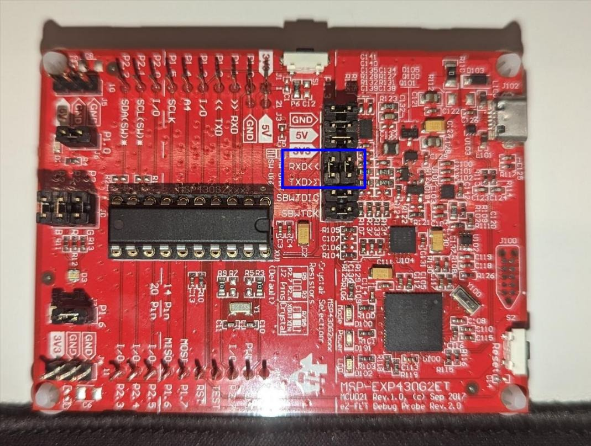

I've used Fedora, but other distros have the same packages (at least ubuntu, nix and arch have them).

# important 

To establish a connection with your msp430 serial connection, it is necessary to cross the rx and tx jumpers.



1) clone this repo

```bash 
git clone https://github.com/nilsherzig/msp430_linux
```

2) Install needed packages (or find the right ones for your distro)

[setup](./setup.sh)

3) compile

```bash
make
```

4) flash to msp430

```bash
make run
```


5) connect to `/dev/ttyACM1` via screen with baudrate 9600

```bash
TERM=xterm sudo screen /dev/ttyACM1 9600
```
