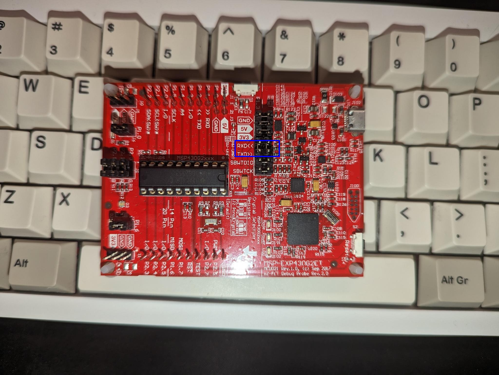

I've used Fedora, but other distros have the same packages (at least ubuntu, nix and arch have them).

You can find a preconfigured fedora (38) docker container in this repo. See step #7.

## important 

To establish a connection with your msp430 serial connection, it is necessary to cross the rx and tx jumpers.



## manual install 

1) clone this repo

```bash 
git clone https://github.com/nilsherzig/msp430_linux
```

2) Install needed packages (or find the right ones for your distro)

```bash
# install base dev tools and libs
sudo dnf groupinstall -y "Development Tools" "Development Libraries"

# msp430 tools
sudo dnf copr enable nielsenb/msp430-development-tools -y
sudo dnf install -y msp430-elf-gcc msp430-elf-binutils msp430-elf-gdb mspds msp430flasher msp430-gcc-support-files dos2unix libusb readline mspdebug
```

3) compile

```bash
make
```

4) flash to msp430

```bash
make run
```


5) connect to `/dev/ttyACM1` via screen with baudrate 9600

```bash
TERM=xterm sudo screen /dev/ttyACM1 9600
```

6) optional - generate clangd `compile-commands.json` for lsp autocompletion in your editor

```bash
bear -- make
```

## using docker

1) use docker to compile and flash the your code

```bash 
docker build . -t mspflash
docker run --privleged mspflash # use configure udev rules instead of privleged
```
